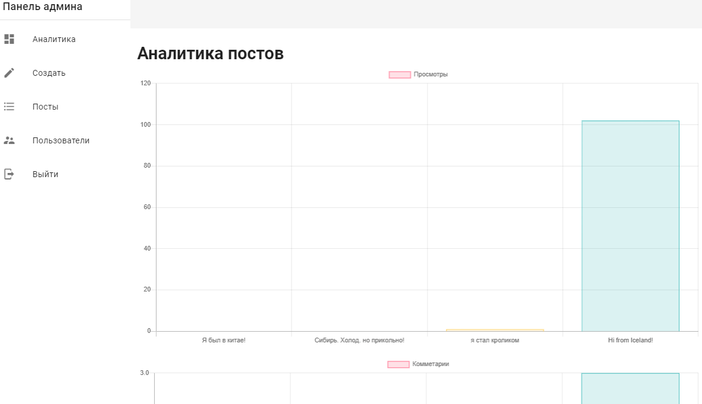

# nuxt-vuetify-blog

Demo: https://nuxt-blog-vuetify.herokuapp.com/

  Сделал своё первое приложение с *API на Nuxt.js с Vuetify*
  Узнал много всего нового! Теперь те проблемы, с которыми я тогда встретился, сейчас кажутся чем-то очень лёгким.
  В блоге есть **админка** с возможностью добавления постов, есть аналитика постов, есть **авторизация** и **аутентификация с токенами**.
  Все посты лежат на **MongoDB**.





## Build Setup

```bash
# install dependencies
$ yarn install

# serve with hot reload at localhost:3000
$ yarn dev

# build for production and launch server
$ yarn build
$ yarn start

# generate static project
$ yarn generate
```

For detailed explanation on how things work, check out [Nuxt.js docs](https://nuxtjs.org).
